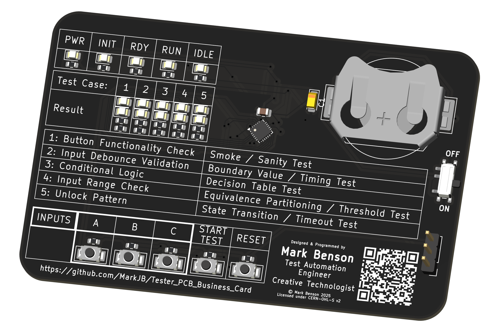
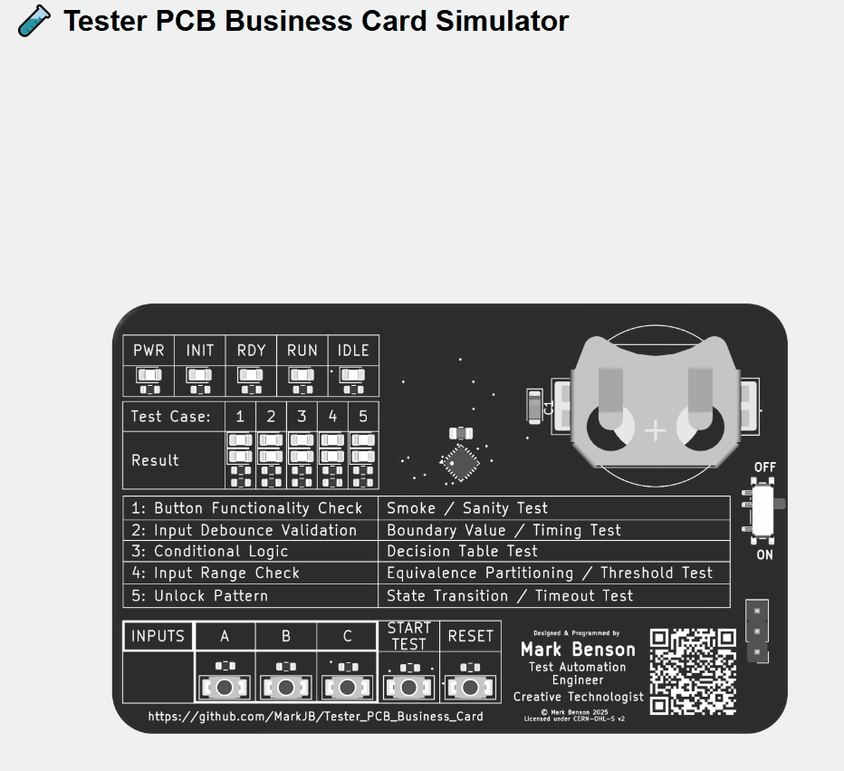

# Tester PCB Business Card

A PCB Business Card designed by a tester, for testers (QA Engineers)

I've always liked the PCB business cards I've seen people design. They often have an interesting story about the why and the how, and sometimes even lead to a job offer as a result!

> Note: For any recruiters or prospective employers who end up here, I'm a software tester specializing in WebUI test automation. Electronics and hardware is a hobby (and occasionally a freelance gig in the Creative Technologist/Arts and Technology space)

I wanted to give it a go but couldn't think of anything compelling that was related to my primary industry (QA, Software Testing & Test Automation). Then I saw a recent [pong example on Hackaday](https://hackaday.com/2025/08/13/pcb-business-card-plays-pong-attracts-employer/) which made me wonder whether the author had done much testing, and that sparked the idea of creating a PCB business card all about testing.

There are 5 'test cases'\*, each one designed to be a little bit harder than the previous one and to focus on a different class of test. The hardware is somewhat limited, so how well each of the tests achieves its intended goal or how true it is to its test type is open for debate and I welcome feedback from actual testers!

The idea is that a tester should be able to look at the test case description, its test type and, given the available inputs and output, figure out how to get the tests to pass, treating it as a sort of black-box exploratory test session. Think of it as a fidget toy for tester.

That all said, I've not yet had any feedback from any testers so I don't know if its too easy or too hard. If you want to cheat, dig into this repo and you'll find the test case BDD scenarios and solutions (which I have deliberately not linked from any of the main READMEs), or as an alternative you can read the code (either the main firmware or the simulator should provide a white-box experience).

\* I use the term "test cases" to refer to the tests that the hardware is presenting to the end user to 'execute', but in some places I have also created actual tests for the code as well (like the Playwright tests for the simulator).

> Note: There may be minor differences between the simulator and the actual hardware due to implementation details or I changed direction while working on the firmware and haven't gotten round to updating the simulator.

So here is Rev A:

This is based on the CH32V003F4U6. A 27¢ micro controller with a one-wire programmer that costs less than $8. I had no experience with this when I started this project, but cost was a big factor with the card. I'm aiming for sub $2 per unit so I can a) afford to get a handful made and b) give them away at conferences and networking events.

> Note: I added a slot for attaching to a lanyard as I intend to give these out at networking and conference events.

This repo includes:

# Hardware

The [schematic](./resources/schematic.pdf), PCB design, BoM and JLCPCB ready production files [Kicad 9 files here](./hardware/)

# Software

## Simulator

Simulator [README](./software/simulator)

The simulator is butil, tested and (if successful) deployed to GitHub pages by a [GitHub Actions pipeline](https://github.com/MarkJB/Tester_PCB_Business_Card/actions)

You can play with the deployed simulator here: [Simulator Demo](./assets/tester_pcb_business_card_simulator.gif)

## Firmware

Uses platformio and the ch32fun framework.

[Main firmware](./software/firmware/tester_runtime/): The main firmware containing tests, test case runner, LED control, button functions etc.

[Board check](./software/firmware/board_check/): Simple test firmware to confirm LEDs and buttons are connected and working. Mainly used for testing hand assembled prototype boards.

[LED Tune](./software/firmware/led_tune/): Simple firmware to allow manual tuning of resistor values. shouldn't need this again unless the LEDs are changed for ones that are significantly different.

# Licenses

Copyright Mark Benson 2025

The hardware is licensed under the CERN-OHL-S v2 license.
The software is licensed under the MIT license.

Usual disclaimer - No warranty implied or given for any use or outcome of any of the available materials, etc. 

This isn't a toy, it's not suitable for children. As it's not in a case, there is a risk of short circuiting the components and battery, resulting in damage or overheating, so do not put it in your pocket or bag or anywhere where metal objects could cause short circuit. Note: Battery should be inserted + side up. Incorrectly inserted battery will short out resulting in damage or overheating. Use at your own risk.
