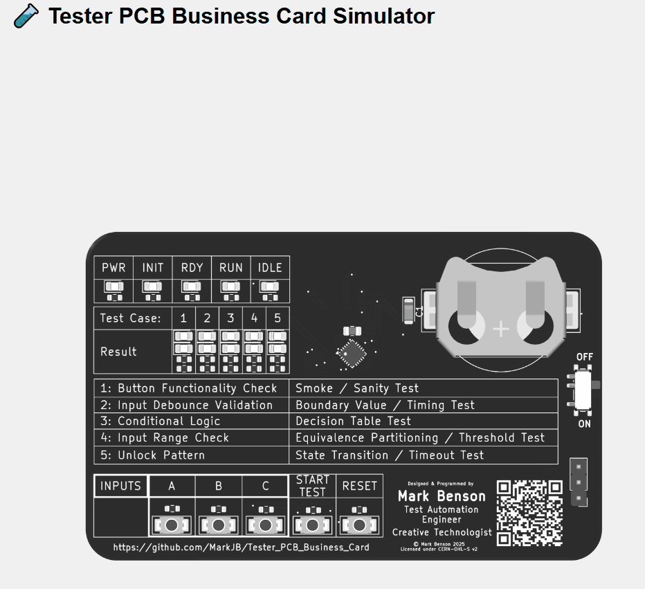

# 🧪 Tester PCB Business Card Simulator

An interactive browser based simulator for the Tester PCB Business Card — designed to evaluate the user experience before the hardware was available. Also to check if the test cases were interesting and engaging and not too obscure for the end user/tester.

Designed in collaboration with Co-pilot - I don't think I'd have been able to spin this up as quickly or get as far as I have in a short space of time without it.

The code went through a number of iterations and ended up informing a lot of decisions that carried over to the real firmware. For instance, I ended up creating a simple test runner with setup and teardown as well as abstracting the hardware. I ended up feeding the test cases along with the BDD scenarios into CoPilot to help generate the test cases for the firmware.

I've also spent some time creating Playwright tests and adding a workflow to build, test and deploy the simulator to github pages. You can test out [the simulator here](https://markjb.github.io/Tester_PCB_Business_Card/)

  
_Animated preview of the simulator in action - Power on/off, system init, reset, start test, restart test_

---

## 🚀 Getting Started

This simulator runs in the browser using JavaScript and SVG overlays.

### 📦 Prerequisites

- Node

### 🛠 Setup Instructions

1. **Checkout the repo**
   ```bash
   git clone https://github.com/MarkJB/Tester_PCB_Business_Card.git
   ```
2. **Navigate to the simulator folder**
   ```
   cd Tester_PCB_Business_Card/software/simulator
   ```
   3. **Install dependencies**
   ```
   npm ci
   ```
   4. **Start the simulator**
   ```
   npm run dev
   ```
   5. **Open simulator in browser**
   ```
   Go to http://localhost:5173
   ```
   (or whatever port it opens on for you)

### 🛠 Usage Instructions

The power switch toggles the power on/off
The input buttons A, B & C are used in the tests. Pressing one of these will briefly light up the INIT status LED.
The "START TEST" button will start a test run of all tests. Each test runs for 5 seconds. The result will be shown at the end of the test (Green for pass, red for fail, TBD flashing green for warning). Press "START TEST" to advance to the next test or restart the test run when it is finished.
Pressing "RESET" will reset the simulator and test progress.

Its up to you to figure out how to pass all the tests.

Note: There are spoilers/solutions in the repo.
